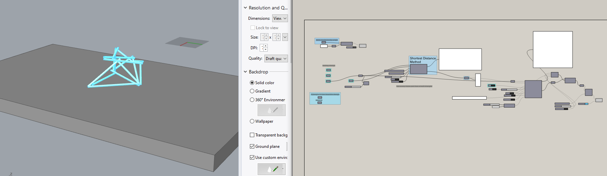
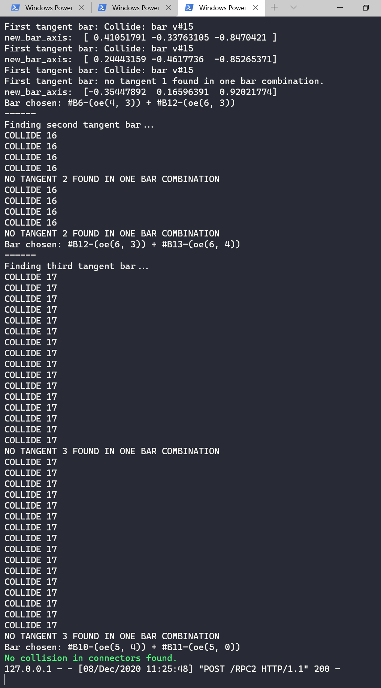

This folder contains some Grasshopper scripts for using `coop_assembly` to generate
double-tangent bar designs with different design logics.

## STABLE

For Stefana and her students, I recommend using the `STABLE_double_tangent_bar_generation.gh`, which is a `stable` version for using the `tetrahedra group` design logic.

The script only uses primitive GH components and python scripts, no other external GH dependency needed. So it should work on Rhino for Mac as well, although I haven't tested it.

Upon opening (if everything works as expected), you should get the following:



### Recommended procedures for using RPC

**Before** opening GH, please open a command prompt, activate the conda environment where you installed `compas`, and issue:

```bash
> compas_rpc start
```

This will create an RPC server and you will later see your python printout streamed to your command prompt. You can read more about this on [compas's rpc documentation](https://compas.dev/compas/latest/api/compas.rpc.html#rpc-command-line-utility-1).

You should be able to see something like the following in the command prompt when computing in GH:



If you can't see these, it means that you have an RPC server runnning *prior* to the commandline `compas_rpc start`. You can kill these running servers by going to the task manager, and manually "end task" all the running `Python` applications.

## DEV

My experimental work is contained in `DEV_double_tangent_bar_generation.gh`. The script includes my attempts to generate `arbitrary spatial truss` using a search routine. 

It also contains a piece of script that I found online [here](https://discourse.mcneel.com/t/reciprocal/73990/2) to use Kangaroo2 to solve the collision problems for a tangent construction.
